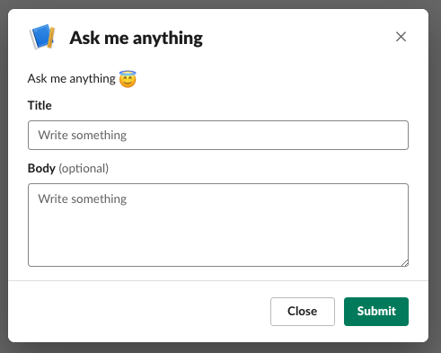

# slack-github-issues

[](https://quay.io/repository/ryotarai/slack-github-issues)

Create GitHub issues via Slack Slash Command

## How it works

### Inline

If Slash Command is called with text, GitHub issue will be created with the text.

e.g.

```
> /ask Something is wrong with my computer
< Opened https://github.com/org/repo/issues/1
```

### Modal dialog

If Slash Command is called without any text, a modal dialog appears:



## Installation

In this instruction, assuming Slash Command name is `/ask` and this app is accessible as https://yourapp.example.com

### 1. Create a Slack App

0. Go to https://api.slack.com/apps and create a new app
0. Go to "Basic Information" page and get "Signing Secret"
0. Go to "OAuth & Permissions" page, add `chat:write` and `commands` to "Bot Token Scopes"
0. Install the App and get "Bot User OAuth Access Token".
0. Go to "Slash Commands" page and add `/ask` command with request URL `https://yourapp.example.com/slack/events`
0. Go to "Interactivity & Shortcuts" page, enable "Interactivity" and put `https://yourapp.example.com/slack/events` into Request URL

### 2. Deploy this app

Create a config file as follows:

```json
{
    "listeners": [
        {
            "commandName": "ask",
            "owner": "org",
            "repo": "repo",
            "labels": ["ask"],
            "modalTitle": "Ask me anything",
            "modalDescription": "Ask me anything :innocent:",
            "modalSubmissionMessage": "Thank you for submission :+1:"
        }
    ]
}
```

Deploy `quay.io/ryotarai/slack-github-issues` image with the following environment variables:
(Make sure this app is internet-accessible because Slack needs to send requests)

* `GITHUB_TOKEN`: GitHub Personal Access Token
* `SLACK_BOT_TOKEN`: "Bot User OAuth Access Token" from Slack App page
* `SLACK_SIGNING_SECRET`: "Signing Secret" from Slack App page
* `GITHUB_SLACK_CONFIG`: Path to config file
* `GITHUB_BASE_URL`: (Optional) If you are GitHub Enterprise user, set this to `https://ghe.example.com/api/v3`
